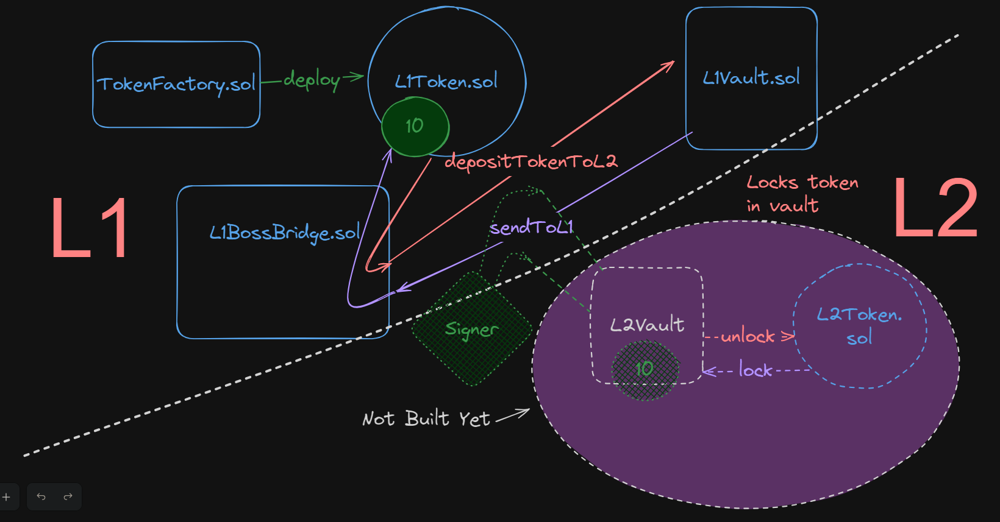

# NOTES

Each vaults works with 1 token.

How signing works:
1. Take private key + message (data, function selector, parameters).
2. Smash it into **Elliptic Curve Digital Signature Algorithm** (ECDSA)
    1. This outputs `v`, `r`, and `s`.
    2. We can use these values to verify someones signature using `ecrecover`.

How verification works:
1. Get the signed message.
2. Break the signed message into v ,r ,s.
3. Get the data itself.
4. Use it as input parameters for `ecrecover`.

The `ecrecover` function works by taking in 3 parameters: *the hash of the original message*, *its signature*, *and its signer’s public key* & returns *the signer's address*.
recover address associated with the public key from the elliptic curve signature,returns zero on error.

 

